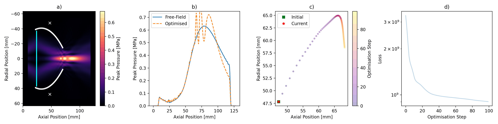
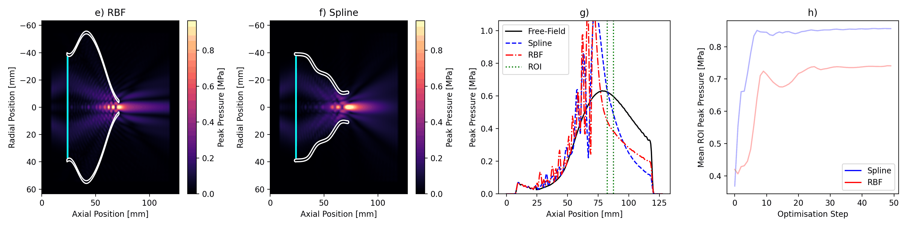

# Differentiable physics-informed design framework for ultrasound coupling cones and domes

_Geometry Optimisation Examples_

**Bézier curve** — optimised to match a free-field reference pressure field:

  

**RBF + Spline** — optimised to maximise focal pressure:

  

